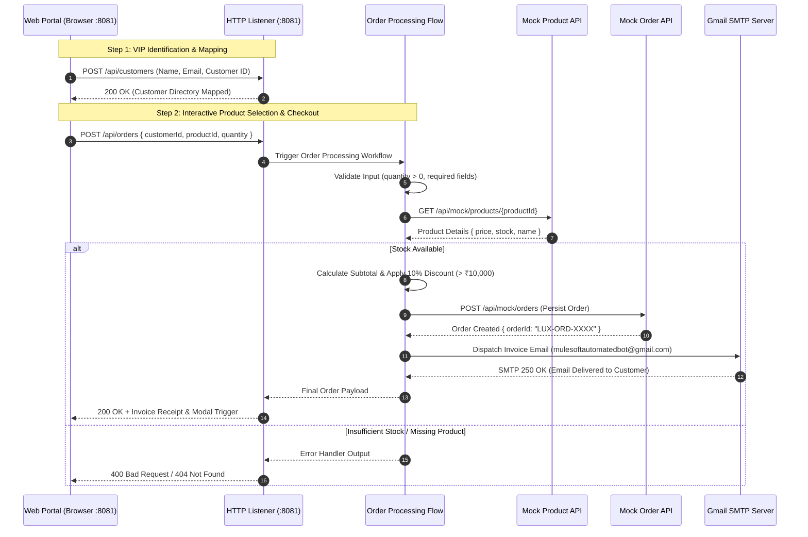

# MuleSoft Order Management Integration Architecture

## 1. System Overview

This document outlines the architecture for the production-grade **MuleSoft Order Management System (`email_test1`)**. The solution exposes an interactive Haute Couture & Luxury Fashion E-Commerce portal, validates order details, queries mock/external catalog APIs, applies business logic (including dynamic 10% VIP discounts), maps orders to customer profiles, inserts order records, and dispatches invoice notifications via Gmail SMTP.

---

## 2. Architecture & Dataflow Diagram



---

## 3. Endpoints Specification

| Endpoint | Method | Description | Request Payload | Response Payload |
| :--- | :--- | :--- | :--- | :--- |
| `/` | `GET` | Serves Interactive E-Commerce Web Portal | N/A | HTML Document |
| `/api/customers` | `POST` | Maps Customer Profile in System Directory | `{ customerId, name, email }` | `{ success: true, customer: {...} }` |
| `/api/orders` | `POST` | Core Order Processing Engine | `{ customerId, productId, quantity }` | `{ success: true, orderDetails: {...} }` |
| `/api/mock/products/{id}`| `GET` | External Product Catalog Service | N/A | `{ productId, name, price, stock }` |
| `/api/mock/orders` | `POST` | External Order Persistence Service | Order Object | Order Object + Generated `orderId` |
| `/api/mock/notifications`| `POST` | External Notification API | Notification Payload | `{ status: "Notification Delivered" }` |

---

## 4. Business Logic & Transformations

### Discount Rule Logic (DataWeave 2.0)
Orders with a total subtotal exceeding **₹10,000** automatically qualify for a **10% VIP Discount**.
```dataweave
%dw 2.0
output application/json
var subtotal = vars.productInfo.price * vars.orderRequest.quantity
var discount = if (subtotal > 10000) (subtotal * 0.10) else 0
var finalAmount = subtotal - discount
---
{
	"customerId": vars.orderRequest.customerId default "CUST001",
	"customerName": vars.orderRequest.customerName default "VIP Customer",
	"customerEmail": vars.orderRequest.customerEmail default "sramakrishnan2196@gmail.com",
	"productId": vars.orderRequest.productId,
	"productName": vars.productInfo.name,
	"quantity": vars.orderRequest.quantity,
	"subtotal": subtotal,
	"discount": discount,
	"totalAmount": finalAmount,
	"status": "CREATED"
}
```

---

## 5. Error Handling Matrix

| Custom Exception Type | Source Condition | HTTP Status | Response Payload |
| :--- | :--- | :--- | :--- |
| `APP:INVALID_INPUT` | Missing `productId` or `quantity <= 0` | `400 Bad Request` | `{ "success": false, "errorType": "INVALID_INPUT", "message": "..." }` |
| `APP:PRODUCT_NOT_FOUND` | Product ID not found in Mock Catalog (404) | `404 Not Found` | `{ "success": false, "errorType": "PRODUCT_NOT_FOUND", "message": "..." }` |
| `APP:INSUFFICIENT_STOCK` | Requested quantity exceeds available stock | `400 Bad Request` | `{ "success": false, "errorType": "INSUFFICIENT_STOCK", "message": "..." }` |
| `HTTP:CONNECTIVITY`, `HTTP:TIMEOUT` | External API connection or timeout error | `503 Service Unavailable` | `{ "success": false, "errorType": "EXTERNAL_API_FAILURE", "message": "..." }` |
| `ANY` | Uncaught system exception | `500 Server Error` | `{ "success": false, "errorType": "INTERNAL_SERVER_ERROR", "message": "..." }` |

---

## 6. How to Run & Verify

1. **Start MuleSoft Runtime / Project**:
   - Run `email_test1` in Anypoint Studio or execute via Maven (`mvn clean mule:run`).
2. **Access Web Interface**:
   - Open browser at `http://localhost:8081/`.
3. **Test Complete Customer Workflow**:
   - Register customer profile (e.g. `Rama Krishna`, `sramakrishnan2196@gmail.com`).
   - Select luxury products by clicking category tabs (Suits, Watches, Handbags).
   - Click product cards to preview real-time price, quantity adjustments, and 10% discount highlights.
   - Click **Place Order** to trigger the MuleSoft pipeline.
   - View live generated Invoice receipt modal & check inbox for automated Gmail SMTP invoice dispatch!
